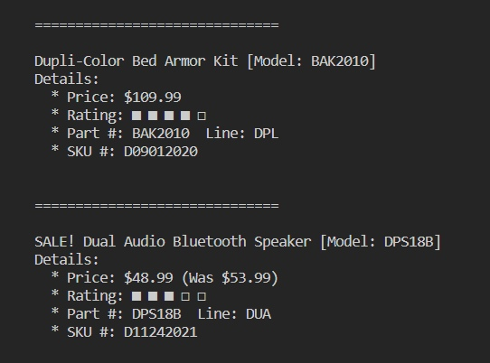

| INFO PROPERTY    | VALUE                                   |
| ---------------- | --------------------------------------- |
| Program Name     | Demo: Print Auto Parts Price Label Info |
| Public File Name | app.js                                  |
| Date Created     | 01/19/23                                |
| Date Modified    | --                                      |
| Version          | 00.00.01                                |
| Programmer       | Eric Hepperle                           |

## Purpose:

Demonstrates displaying formatted price label info in nodeJS console
    
## Usage:

- Run in node console with `node app.js`
    
## Sample results: 
[N/A]

## Requires:
* NodeJS & NPM installed
    
## Demonstrates:
* Vanilla JavaScript

## TAGS:
`JavaScript` `JSON` `NodeJS` `Ratings` `Emoji` `Auto Parts`
